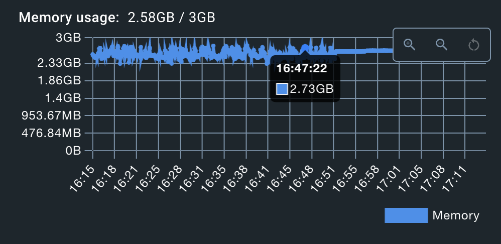
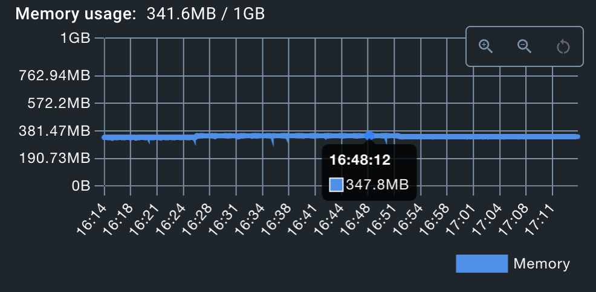

# neo4j-db-importer
Project with purpose to import a huge JSON file into a Neo4J db using the least amount of time and RAM

Here is the logic we used to import the data:

A deployment is launched that will create a single pod with, inside, an "app" container for java and a "db" for neo4j. With 1GB RAM for the app and 3GB RAM for the DB.

We then launch the code that will insert the data. It makes several passes over the file streamed directly from the teacher's server, thus avoiding the need to store it on disk or in RAM. We've override the GSON library's JsonReader class so that it sanitizes the JSON's "NumberInt" during reading, making the JSON readable. On the 1st pass, the code will insert the articles and authors into the database. Then it creates the links between them. All these operations are performed in batches of 50,000 nodes. In effect, we create different HashMaps containing the data to be inserted, and as soon as their size reaches 50,000, we run a Cypher command to insert them before continuing on to the next 50,000.

The following graphs show RAM usage for each of the 2 containers (on our local machine) to give an estimate. The first for the DB and the second for the app.

